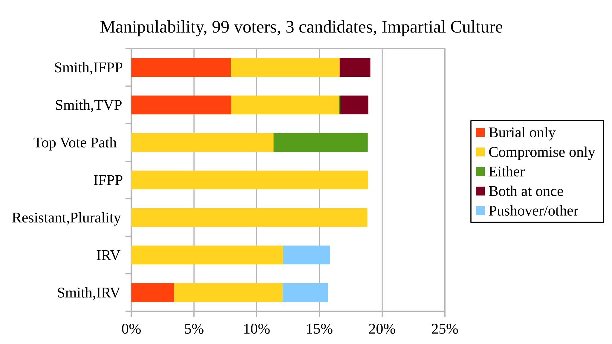
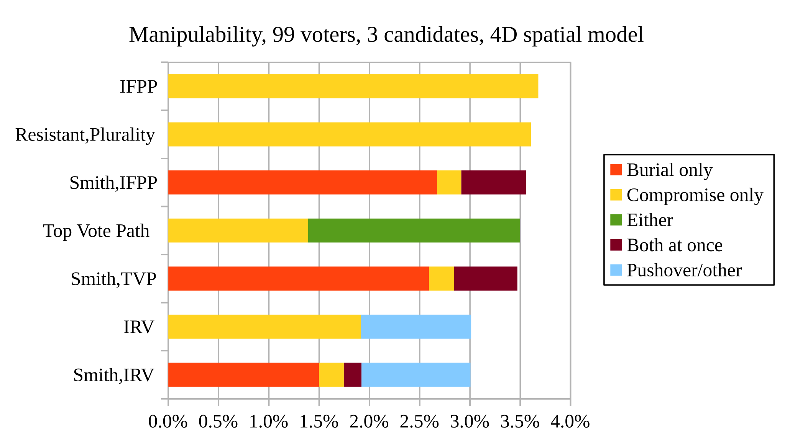

# Top Vote Path

This directory contains a Python implementation of the "Top Vote Path" method
that elects from the [resistant set](https://electowiki.org/wiki/Resistant_set) and passes monotonicity ([mono-raise](https://electowiki.org/wiki/Monotonicity#Mono-raise_criterion)).

As far as I know, no other method passes both of these criteria.

The implementation is somewhat terse in how the method itself works and why it works. I may add something more formal later, but this [Election-Methods mailing list post](http://lists.electorama.com/pipermail/election-methods-electorama.com//2025-August/007033.html) gives the general reasoning.

## Resistance to coalitional manipulability

The following figures show TVP's susceptibility to manipulation by voters under two different models: the [impartial culture](https://electowiki.org/wiki/Impartial_culture) and a [spatial model](https://repository.essex.ac.uk/27745/8/Adams,%20Merrill,%20Zur%20%282020%29%20The%20Spatial%20Voting%20Model-1.pdf). The results are consistent with electing from the resistant set: TVP's low susceptibility is comparable to [IFPP](https://electowiki.org/wiki/Improved_First_Past_the_Post), another such method.

For comparison, [Minmax voting](http://electowiki.org/wiki/Minimax_Condorcet_method) is manipulable around 95% of the time in the given impartial culture setting, and around 20% of the time in the given spatial model.

